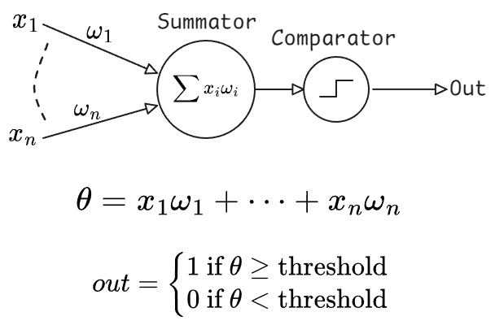
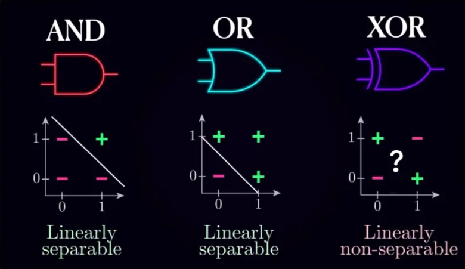

<b>Table of Contents</b>

- [The Perceptron](#the-perceptron)
- [Electrical Excitability and action potential](#electrical-excitability-and-action-potential)
- [The Perceptron resembles the neuron, does it?](#the-perceptron-resembles-the-neuron-does-it)
- [Dendrites: the passive receivers](#dendrites-the-passive-receivers)
  - [Cable Theory](#cable-theory)
- [Dendrites aren’t just passive receivers, they have computational power.](#dendrites-arent-just-passive-receivers-they-have-computational-power)
- [The Computational Capabilities of a Single Neuron](#the-computational-capabilities-of-a-single-neuron)
  - [Digital Logical Operation](#digital-logical-operation)

# The Perceptron

Early neural networks were indeed inspired by the descriptions of biological neurons, which people thought to be accurate at the time. In fact, the birth of machine learning as we know it, can be traced back to 1943 when Walter Pitts and Warren McCulloch introduced the notion of a perceptron. Despite the fancy name, the idea is quite simple. The perceptron was created to function like an individual nerve cell, which in this doctrine, works like a simple summator and comparator. This just means that it receives an input set of numbers, multiplies them by some coefficients, also called weights, sums everything together and compares the result with a threshold. If the resulting value exceeds the threshold, the perceptron sends the number 1 as an output to its neighbors.

You interconnect a bunch of these perceptrons with each other such that the output of one perceptron serves as an input to a downstream perceptron, encode an input and output layer and tada! You've got a neural network!

](images/deepLearn_2_EN-2048x1024.png "Deep Neural Network. SOURCE: [Lamar Institute](https://lamarr-institute.org/blog/deep-neural-networks/)")

But at that point, after the perceptron model was created based on an inaccurate understanding of biological neurons, the fields of machine learning and neurobiology pretty much diverge. Over the years, people have invented a bunch of activation functions, organized neurons in a multitude of different network architectures, came up with algorithms to change the weights efficiently, and so much more. But because we still refer to the nodes in such networks as neurons, a lot of people believe that biological neurons in the brain function exactly like their perceptron counterparts. The main goal of this blog is to exonerate biological neurons and show that a single biological neuron is much more computationally powerful and sophisticated than you might think.

# Electrical Excitability and action potential

But to understand the computational complexity of a neuron, it's helpful to remind ourselves of the basic biology behind neural computations. If you open any neuroscience textbook, one of the first things you'll see is the structure of a typical neuron, which usually consists of dendrites, a soma (or cell body), and an axon.

Dendrites, the signal receivers, collect input from other neurons and transmit it to the soma. The soma, the processing center, integrates these signals and determines whether to trigger an action potential. If activated, the signal travels down the axon, the signal transmitter, which carries the message to its destination. At the end of the axon, synapses pass the information to other neurons through neurotransmitters.

](images/626817de755615adf9c049c6_fjRljM4EbLQYuKxbMJQwhBOk6mixKG1jxHP-ZAqb0zMZ6DbTFnBHaFUqs6ppiEZUc7xCRBwC3aYKDIuPpJxxto39cpudf2yEs4wKHr9zh6OG-8KVkm2xtStT0olQcrw-9YCQ0qRg.png "The three main parts of a neuron. SOURCE: [The Partnership in Education](https://www.thepartnershipineducation.com/resources/nervous-system)")

The key property of neurons is that they are electrically excitable cells which means they have the capacity to generate brief electrical pulses that are propagated to other neurons, forming a basis of communication between cells.

](images/Back_propagating_action_potential.gif "Electric excitability at the membrane of the neuron causing an action potential. SOURCE: [Wikimedia Commons](https://commons.wikimedia.org/wiki/File:Back_propagating_action_potential.gif)")

In biological systems, electric charge is carried by ions such as sodium, potassium, chloride and calcium which are floating both inside and outside the cells in different proportions. Cells are separated from the outside world by a lipid membrane, a barrier normally impermeable to ions. However, neurons possess special proteins forming channels through which specific ions can cross the membrane and which can open and close through a variety of mechanisms, as we'll see further. So by regulating the flow of ions through the channels, cells can control the balance of electric charges and thus, control the membrane voltage.

Namely, when positive ions flow into the cell, they depolarize the membrane, increasing the voltage and making the potential more positive. Conversely, when positive ions leave or negative ions enter, the membrane repolarizes, decreasing the voltage and returning the potential to its resting state.

](images/Cell-Membrane-Pumps.gif "Ions movement during depolarization and repolarization. SOURCE: [UBC Blogs](https://blogs.ubc.ca/mrpletsch/2019/04/29/the-nervous-system-part-3-impulse-transmission/)")

There’re many types of ion channels, we'll be mostly interested in what's called voltage gated channels, which can open and close depending on the value of membrane potential.

We usually learn about voltage gated channels in the context of action potential generation. So just to remind ourselves, an action potential, which is the unit of communication, is often said to be all or none output of a neuron. In a simplified description, it is generated at the origin of an axon where there is a large number of special sodium channels that open when the membrane voltage exceeds a certain threshold. Because sodium is a positively charged ion, when it rushes into the cell, membrane gets depolarized even further, recruiting more sodium channels to open and so forth, like a positive feedback loop. That wave of sodium channels opening up is transmitted along the axon and gets indirectly passed onto other neurons by the means of synaptic transmission. However, sodium channels don't stay open forever and eventually they close while another type of channels opens, allowing potassium, also a positively charged ion, to leave the cell bringing the membrane voltage back to its resting level.

](images/depolarization-action-potential-crash-course.gif "Sodium gates (purple) let forth a flood of positive sodium ions (red) into the neuron, resulting in depolarization. SOURCE: [Crash Course](https://www.youtube.com/watch?v=OZG8M_ldA1M)")

](images/repolarization-crash-course-action-potential.gif "Membrane repolarization. Sodium channels (light purple) close. Potassium channels (dark purple) open and diffuse positively charged ions out of the cell. SOURCE: [Crash Course](https://www.youtube.com/watch?v=OZG8M_ldA1M)")

Et Voila! We have just generated an action potential and sent one bit of information to downstream neurons.

# The Perceptron resembles the neuron, does it?

**You might already see why the initial description of a neuron as a perceptron seemed reasonable.**
After all, we have just witnessed how a thresholding function is implemented in a neuron through voltage gated channels. So that part is accurate, right? Indeed, the main problem with the perceptron is mostly with inputs, not the output.

It's time for us to get back to the dendrites, the information receiver in the biological neuron, and see how exactly they contribute to the computations on incoming information.

# Dendrites: the passive receivers

Now, the way it is often presented is that dendrites function like passive receivers of information. You see, the signal is transmitted between two neurons when the axon of one neuron forms a special connection, a synapse, with the dendrite of another neuron. Upon the action potential of a sender neuron, also known as the pre-synaptic cell, there is a chain of chemical reactions which leads to a release of signal molecules and eventually resulting in the opening of neurotransmitter gated ion channels on the membrane of the receiver neuron, also known as the post-synaptic neuron. This flux of ions across the membrane of a post-synaptic cell leads to its depolarization, which is propagated along the dendrite and the laws of such propagation of electrical signals in passive membrane, the dendrite’s membrane, is conventionally described by **The Cable theory**.

## Cable Theory

In this paradigm, the dendrites are just that, Cables, whose only job is to transmit electrical signals to the soma. For those of you who are more interested, dendrites are actually treated as imperfect leaky cables, since a single portion of a dendrite is described as a patch of lipid membrane with capacitive properties and a resistive component corresponding to a leak of ions through passive, permanently open ion channels.

](images/image%202.png "Cable theory's simplified view of a neuronal fiber. SOURCE: [Wikipedia](https://en.wikipedia.org/wiki/Cable_theory)")

As a result, the depolarization level is attenuated as it travels along the dendrite. In other words, **the function of dendrites is reduced to summing the incoming signals** where the weight of a synaptic input is determined by the amount of receptors and how far away the synapse is from the cell body. Together with the threshold happening at the soma, **this gives us the biological basis for the perceptron model.**

# Dendrites aren’t just passive receivers, they have computational power.

However, as neuroscientists study the cells more closely, it became clear that dendrites are anything but passive cables and the reason for that is that, apart from permanently open passive ion channels which give them their leaky properties, dendrites are also covered by a myriad of voltage gated ion channels which equip the dendritic tree with powerful information processing capabilities even more powerful than the soma itself. For example, dendrites actually contain voltage gated sodium channels similar to the ones found on the axon. They allow action potentials to travel in reverse direction and influence the post-synaptic sites. This is called backpropagation and it plays an important role in synaptic plasticity, adjusting the weights of inputs.

](images/giphy.gif "Neurons creating new pathways through synaptic plasticity. SOURCE: [GIPHY](https://giphy.com/gifs/science-experiment-manifestationwithsami-neuroplasticity-DcoTvMAwrzAbXrVnuC)")

Another important type of channel is NMDA receptor, which requires both sufficient membrane depolarization and the presence of neurotransmitter to open, thus functioning like a kind of coincidence detector. NMDA channels are non-selective to cations (positive ions), allowing both calcium and sodium to flow into the cells which has great implications for things like synaptic plasticity. This depolarizing event is often called an NMDA spike. Unlike pure sodium spikes, these are generated by the influx of calcium as well and are characterized by a much longer time scale of hundreds of milliseconds. Importantly to our discussion, NMDA channels allow the dendrites to perform non-linear integration of incoming information, this equips dendrites with vast computational complexity.

For example, dendrites can discriminate the order of incoming action potentials. This means that if you took a group of synapses on a dendrite of a cortical pyramidal neuron then a sequential activation of them in one direction will produce a fundamentally different electrical and chemical response than activation in reverse direction. And this is sensitive not only to order, but also to the velocity of activation.

](images/785044ef-66e4-4222-a740-efc5d0db9516.png "SOURCE: [Branco et al. 2010](https://doi.org/10.1126/science.1189664)")

Thus, single neurons have a mechanism to process temporal patterns and generate sequence selective output. I hope that by now, you have some idea of why biological neurons are much more powerful than a perceptron. But let’s continue, there’s much more to unveil.

# The Computational Capabilities of a Single Neuron

What if I told you that a single neuron in the human cortex is capable of performing a type of computation that requires a multi-layered artificial neural network to implement?

In 2020, a group of researchers published a paper titled 'Dendritic action potentials and computation in human layer 2/3 cortical neurons' where they demonstrated a unique property of human pyramidal neurons. More specifically, they performed simultaneous recordings of electrical activity at the cell body and a dendrite and found a new type of electrical response that was initiated at the dendrites by a sufficiently strong excitatory input. This waveform was termed as dendritic calcium action potential (dCaAP).

As the name suggests, such electrical events are caused by the influx of calcium ions, but have a shorter time scale compared to NMDA spikes. Remarkably, these calcium spikes **are highly selective to a particular input strength**. This means that if you stimulate a neuron with too weak of a current, the membrane voltage would stay below the threshold for opening of calcium channels, so no dendritic spikes would be observed. If, however, you increase the current too much, no spikes would be observed either. You would need to provide the dendrite with just the right strength of stimulation to trigger them.

This fact may not seem like a big deal at first, but it's really important for the way we should treat biological neurons. To better understand what it really means for the neural computations, let's talk briefly about digital logical operations.

## Digital Logical Operation

As you probably know, computers store the information in bits, binary units with only two possible states, zero and one. By the way, I will use the terms 'zero' and 'one' interchangeably with 'false' and 'true,' respectively. To perform computations on binary data, computers use what are called bitwise operations, which are like addition and multiplication, but in binary world. They are performed by logic gates, which are the building blocks of all the digital hardware. Individual logic gates perform simple Boolean operations which you have probably heard about, with the two most popular ones being AND and OR operations. For example, the AND gate receives two inputs and outputs one if and only if both of the inputs are one, while the OR gate outputs one when at least one of the inputs is equal to 1. This is also known as inclusive OR, because the output is true when both of the inputs are true as well. So if we view the inputs as Venn diagrams, the intersection is included.

There is another useful operation which is called exclusive OR, or XOR for short. As the name suggests, the XOR gate outputs true when exactly one of the inputs is true, but not both.

Notice that this agrees with our everyday interpretation of the word 'OR' when we say things like 'Would you like an apple or a banana?' the word 'OR' is usually understood in the exclusive sense, you can only choose one but not both, and in computers XOR can be used for things like comparing two numbers. Importantly to our discussion, XOR is what's called a linearly non-separable function, and this simply means that there is no line for two dimensions, plane for three dimensions, or hyperplane for $n$ dimensions that would separate different classes of output.
For example, let's consider a perceptron which receives just two inputs, similarly to the logic gate, call them $x$ & $y$.

As we have discussed earlier, all that perceptron does is multiply the inputs by their weights, adds everything and compares the result with a threshold. If we denote the weights as $a$ and $b$, then the perceptron essentially solves the inequality $ax+by\ge \text{ threshold}$. But if you consider the geometric representation of this inequality, it's easy to see that this is essentially a line separating the two halves of the $x-y$ plane.

Similarly, if perceptron had three inputs, this equation would correspond to a plane cutting the 3D space into two halves.

That's why a single perceptron can function as a classifier when two output classes are located on opposite sides of that line. In other words, when they are linearly separable. Returning back to our logic gates, the inputs would be limited to zero and one. If we visualize the AND gate, it's easy to see that there is a line separating the true and false outputs, so a perceptron can act as an AND gate, and it is possible to turn it into an OR gate just by lowering the threshold. However, the XOR gate, is different. Notice that there is no line that would separate the false outputs from the true outputs, which makes it a linearly non-separable function.

This is why to perform the XOR operation, a multi-layered network is required. And it was believed to be true for biological neurons as well that individual cells can't compute the XOR function until that paper came out. But how does the biological neuron do it? Remember that the described dendritic spikes showed a prominent selectivity towards the strength of a stimulus. So, for example, let's say the neuron has two sets of synapses, A & B. When either one of the two sets is activated causing a large enough excitation to trigger a dendritic spike which can propagate to the soma and trigger the action potential. However, if both sets of synapses are activated at the same time, the strength of incoming current exceeds the optimal value for dendritic spike generation, and no such event is observed. In other words, the dendrite just performed the XOR operation on A & B inputs. How awesome is that? For those of you who are curious about the biophysical mechanisms of such sensitivity, this remains unresolved. However, through computer simulations, the authors were able to show that this property of dendritic action potentials can be explained by a combination of known voltage gated calcium channels and special potassium channels that are sensitive to both voltage and calcium concentration.

All right, let's recap. We have seen how the presence of voltage gated ion channels turns dendrites from being merely passive conductors of electricity to active computational units. Moreover, individual dendritic branches have the capacity to perform exclusive-or operation on their inputs, a type of computation that was requires multi-layered artificial neural network. 