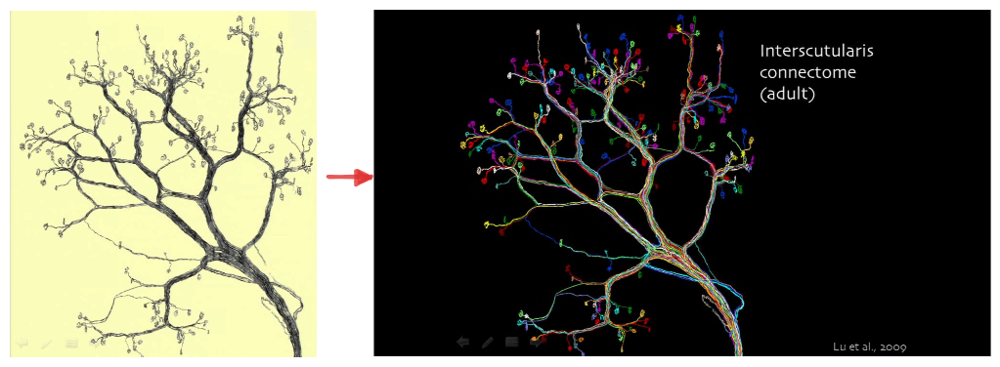
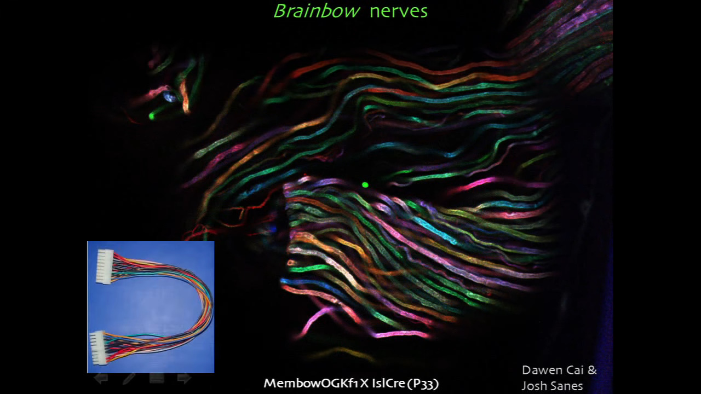
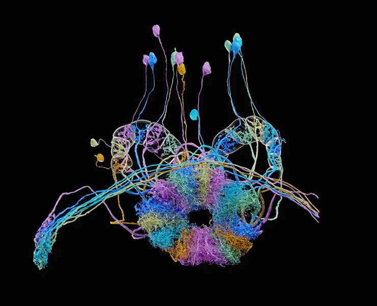
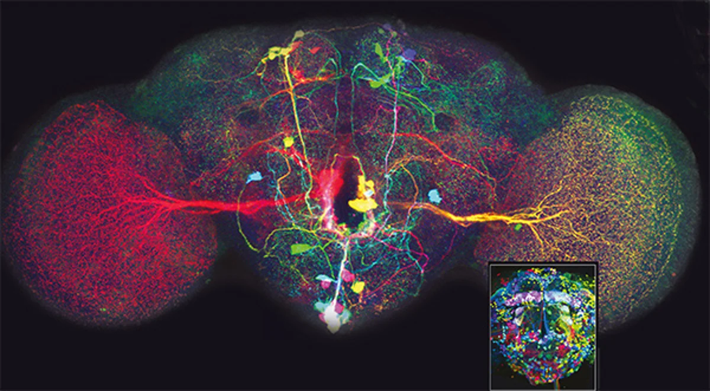

Imagine a world where each cell in our bodies could be uniquely colored, allowing us to track their movements and interactions with unprecedented detail. While this might sound like science fiction, a revolutionary technique known as Brainbow has brought us closer to this reality. **Brainbow is a genetic labeling technique that allows researchers to visualize individual cells within complex tissues by assigning them distinct colors**. This technique has been particularly impactful in the field of neuroscience, offering a powerful lens through which to study the intricate workings of the brain. But how does it work, and what makes it so special?

In essence, **Brainbow draws inspiration from the way colors are generated on a digital display, by combining three primary colors—red, green, and blue—in varying ratios.** However, instead of blending intensities of these colors, Brainbow achieves a complex display within living cells by employing multiple, distinctly colored fluorescent proteins (FPs). These FPs are like tiny light bulbs that emit light of different colors when excited by specific wavelengths.

To create this multicolored cellular landscape, researchers introduce multiple copies of a specially designed genetic construct into the genome of target cells. This construct contains genes coding for different FPs, strategically arranged to ensure that each cell expresses a unique combination of these FPs, resulting in a distinct color for each cell.

While the exact combination of colors is stochastic, the process follows specific genetic rules governed by a mechanism called Cre-Lox recombination. In this system, an enzyme called Cre recombinase acts upon specific DNA sequences known as Lox sites, which flank the FP genes within the Brainbow construct. The action of Cre on the Lox sites either excises or inverts the genes, leading to different combinations of FPs in each cell.

As a result, each cell in the tissue becomes uniquely colored based on the specific combination of FPs expressed. Researchers can then visualize these cells using specialized microscopes that excite the FPs with specific wavelengths of light, causing them to emit their distinct colors. This technique allows scientists to distinguish individual cells, even within densely packed tissues like the brain, providing an unprecedented level of detail in studying cellular interactions and dynamics.

# Why Brainbow is a Game Changer in Neuroscience?

Brainbow has emerged as a **brilliant neuroimaging technique** due to its remarkable ability to illuminate the brain's intricate workings in a way never seen before. Unlike conventional methods that often label entire cell populations with a single color, Brainbow allows researchers to **distinguish individual cells**, even within the brain's densely packed and complex environment. This is akin to giving each neuron its own unique barcode, allowing scientists to track their journeys and connections with unprecedented precision.

This revolutionary technique has opened up exciting research opportunities in neuroscience, transforming our understanding of the brain's structure, function, and development.

**Mapping the Brain's Intricate Wiring**

One of the most significant contributions of Brainbow has been its ability to unravel the brain's intricate wiring diagram, known as the connectome. By labeling individual neurons with distinct colors, researchers can trace their complex projections and connections over long distances. This has been particularly valuable in studying the neural circuits underlying complex behaviors and functions. For example, in mice, Brainbow has been used to study the relationship between preganglionic and postganglionic neurons, offering insights into the organization of neural circuits involved in sensory and motor functions.

**Unveiling the Secrets of Brain Development**

Brainbow has also proven invaluable for developmental biologists studying the formation and maturation of the nervous system. By targeting Brainbow expression to specific cell populations or developmental stages, researchers can track the lineage of cells over time, observing their migration, differentiation, and integration into complex neural structures. This has been especially insightful in studying the development of the zebrafish hindbrain, where Brainbow revealed coordinated cell death patterns among clonally related cells, highlighting the dynamic nature of brain development.

**Deciphering the Complexity of Neural Heterogeneity**

The brain's remarkable capacity to adapt and learn stems from its diverse array of cell types, each with its unique function and origin. Brainbow helps researchers understand this neural heterogeneity by labeling cells of different lineages with distinct colors. This allows them to trace the developmental history of various cell populations and study how this lineage diversity contributes to the brain's complex structure and function. This knowledge is crucial for understanding the cellular and molecular mechanisms underlying brain development, plasticity, and disease.

In essence, Brainbow's ability to transform the brain from a seemingly impenetrable tangle of neurons into a vibrant tapestry of individually distinguishable cells has revolutionized neuroscience. By providing this unprecedented level of cellular resolution, Brainbow empowers researchers to ask and answer fundamental questions about the brain that were previously impossible to address. As technology continues to advance, we can anticipate even more creative and powerful applications of Brainbow, further illuminating the brain's remaining mysteries.

# Mechanism

**Creating the Brainbow Construct**

The process begins with a specially designed piece of DNA called the Brainbow construct. This construct contains genes that code for three or four different fluorescent proteins (FPs). Imagine these FPs as tiny light bulbs that emit light in different colors, like red, green, and blue.

**Lox Sites: The Genetic Guides**

These FP genes are strategically placed within the construct, separated by specific DNA sequences called Lox sites. Lox sites act like "cut and paste" markers recognized by a specific enzyme. The arrangement and orientation of Lox sites dictate whether the intervening DNA is excised or inverted during recombination.

**Cre Recombinase: The Genetic Scissors**

The Cre recombinase enzyme is the workhorse of the Brainbow technique. When introduced into a cell, Cre scans the DNA, hunting for Lox sites. Think of Cre as a pair of genetic scissors, programmed to cut at the Lox sites.

**Stochastic Recombination: The Color Lottery**

When Cre finds two matching Lox sites, it cuts the DNA between them, rearranging the sequence. This rearrangement alters the FP gene expression pattern. Each copy of the Brainbow construct has an equal chance of expressing any one of the FP genes. It's like a lottery, where each cell gets a random combination of FPs that results in a unique color.

**A Kaleidoscope of Colors**

Multiple copies of the Brainbow construct are introduced into each cell. Since each copy recombines independently, a single cell can express different combinations of the FPs. For instance, a cell might express high levels of red FP and low levels of green FP, resulting in an orange hue. This combinatorial expression of FPs leads to a vast spectrum of colors, allowing each cell to have a unique color profile.

# Evolution and New Capabilities

The original Brainbow constructs used a default fluorescent protein (FP) expression system, meaning that one FP would be expressed even without Cre recombination. This system caused color balance to depend on recombinase activity, making it difficult to track cell lineages over time due to potential color changes.

To address this, researchers developed newer Brainbow transgenic lines and somatic labeling tools that don’t express the default FP or use a nuclear-localized FP easily distinguishable from those expressed post-recombination. These improvements give all alternative FPs equal expression opportunities, making color balance independent of Cre activity.

The original Brainbow could generate up to 100 colors, but distinguishing between closely related hues was challenging. To improve color discrimination, researchers developed methods to increase labeling dimensions by targeting different FPs to distinct subcellular compartments. For example, combining cytoplasmic Brainbow (Cytbow) with nuclear Brainbow (Nucbow) significantly increases the number of possible color combinations, making it easier to distinguish between cells and lineages.

Researchers are also exploring ways to go beyond color by combining Brainbow with genomic and genetic analyses. For instance, combining in vivo observations of distinctly colored cell clones with techniques like flow cytometry and single-cell sequencing could provide insights into the genomic profiles and cellular identities underlying neuronal connectivity or clonal behavior.

These advancements highlight the significant evolution of Brainbow technology from a visually appealing tool to a powerful technique with diverse applications in neuroscience, developmental biology, and beyond.
