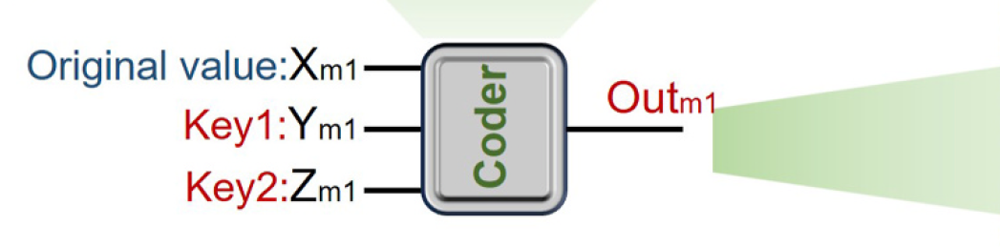
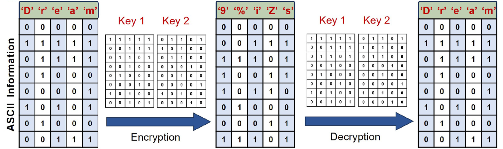
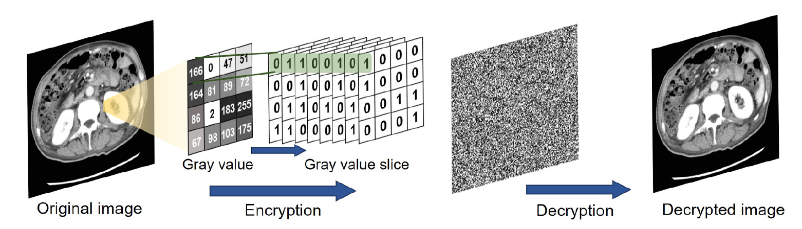
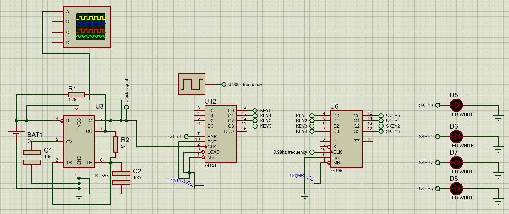
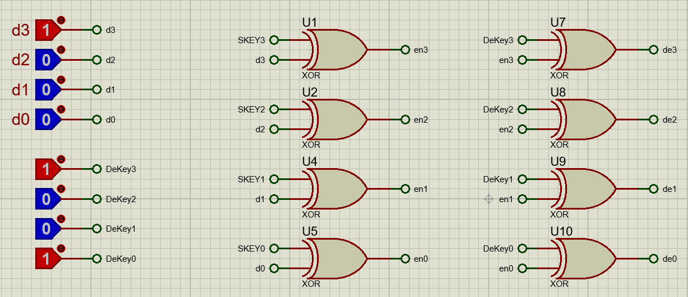
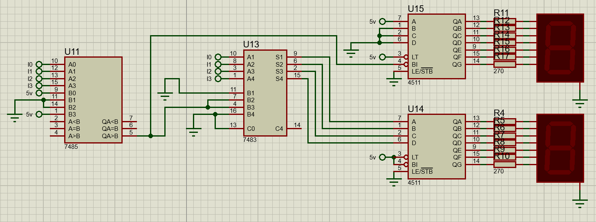

  
<b>Table of Contents</b>

- [Introduction](#introduction)
- [A Paper That Caught My Eye](#a-paper-that-caught-my-eye)
- [Our Own Take: An XOR Cipher Encryption and Decryption Circuit](#our-own-take-an-xor-cipher-encryption-and-decryption-circuit)
  - [Circuit Anatomy](#circuit-anatomy)
  - [XOR Cipher Method](#xor-cipher-method)
  - [The Tough Part](#the-tough-part)

# Introduction

Most of the time, when we talk about data encryption and decryption, we’re thinking software. It’s all around, in apps, operating systems, browsers, etc. Popular encryption algorithms like AES or RSA are all handled in code, either by CPUs or, more recently, by GPUs.

But hardware-based encryption is different. it is just what it sounds like: encrypting, and decrypting, data directly in physical circuits instead of software. That could be something like a USB drive with built-in encryption chips or a custom board that processes data using logic gates before it ever hits a processor.

In the first section of this blog post, I preview a very interesting paper that proposes an intriguing approach to hardware-based encryption that relies on biomemristors. In the second part, I showcase my own project, which I worked on with a teammate, where we built our own hardware-based encryption and decryption circuit based on the XOR Cipher method.

# A Paper That Caught My Eye

I recently came across a research paper that really pushed the idea of hardware encryption in an unusual direction. The paper is called "Data encryption/decryption and medical image reconstruction based on a sustainable biomemristor designed logic gate circuit" by Fulai Lin et al.

The researchers used biomemristor, a type of memory component that works by changing its resistance state depending on voltage. It acts like a brain synapse, and they used it to build actual logic gates and encryption circuits. They used it to encrypt full medical images.

What interested me the most how they took a component known for its brain-like memory behavior and turned it into a working logic system that protects sensitive medical data in a completely physical way.

They chained these biomemristors together to form basic logic gates: AND, OR, XOR, etc. Then they built a 3-to-8 decoder — the kind you’d use to pick out one of eight signals based on a 3-bit input. But instead of just routing signals, they used this to encrypt characters and image data.

 AND logic gate based on the biomemristor and (b) its simulation results. (c) OR logic gate based on the biomemristor and (d) its simulation results. (e)NAND logic gate based on the biomemristor and (f) its simulation results. (g) NOR logic gate based on the biomemristor and (h) its simulation results. (i) Memristorencryption circuit based on 3-8 decoder. (j) XOR logic gate based on biomemristor and (k) its simulation results. (l) Histogram of the simulation results of theencryption circuit.")

Every character was converted into an 8-bit binary value using ASCII. For images, each pixel (grayscale 0–255) also maps neatly to 8 bits.

They fed the data (text or pixel values) into a grid of memristor-based encryption units. Each one took three inputs: the data bit, and two “key” bits. The output depended on this combination, creating an encrypted signal.

For example, they encrypted the string "Dream" into characters like "9%iZs" using these logic paths. The original bits were transformed in hardware using controlled logic gates.

On the receiving end, the same logic — wired with the same key inputs — reversed the process. The encrypted output, when passed through the same memristor paths, gave back the original data.

They applied this same setup to real CT images. Each image was split into binary slices — one for each bit of pixel intensity. These slices went through the encryption units in parallel, scrambling every pixel using a rule set defined by hardware. Decryption followed the reverse path.

So, not only were text files encrypted at the bit level, but entire image matrices were processed, all in hardware, with no CPU in sight.

# Our Own Take: An XOR Cipher Encryption and Decryption Circuit

Together with a teammate, we built a basic hardware encryption and decryption circuit based on XOR Cipher encryption method, a simple yet effective method where data is combined with a key to encrypt it, and then decrypted with the same key. More on that later.

The circuit takes 4-bit binary data as input, Encrypts it using an XOR gate and a generated key. Then decrypts it with another XOR operation using the same key.

## Circuit Anatomy

We broke it into three parts:
1. Key Generation Circuit
    - Built with a NE555 timer, a 74161 counter, and a 74195 register.
    - Generates a 4-bit key and stores it.
    - Uses LEDs to show the key state.
    

2. Encryption/Decryption Circuit
    - 7486 XOR gate ICs handle both encryption and decryption.
    - DIP switches let you input data and the key manually.
    

3. Display Circuit
    - Uses 7-segment displays to show encrypted or decrypted values.
    - A comparator and adder help convert binary to decimal.
    

## XOR Cipher Method
Our circuit is based on XOR Cipher, it's based on the logic that:
$$
\underbrace{\(\text{Data} \oplus \text{Key}\)}_{\text{Encrypted Data}} \oplus \text{Key} = \text{Data} \oplus 0 = \text{Data}
$$

This makes it possible to use XOR both ways, encrypting and decrypting with the same setup. The user enters the data and can either use the generated key or set their own via switches. Once encrypted, the data is shown on a 7-segment display. Hit decrypt, and it flips right back.

## The Tough Part

The hardest bit was figuring out how to cleanly show decimal numbers on two 7-segment displays without overcomplicating the circuit. Our first logic design was too bulky. Eventually, we scrapped it and used a simpler combo of a comparator and a full adder. It worked better and used fewer parts.