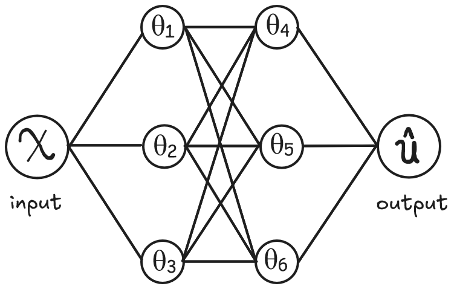
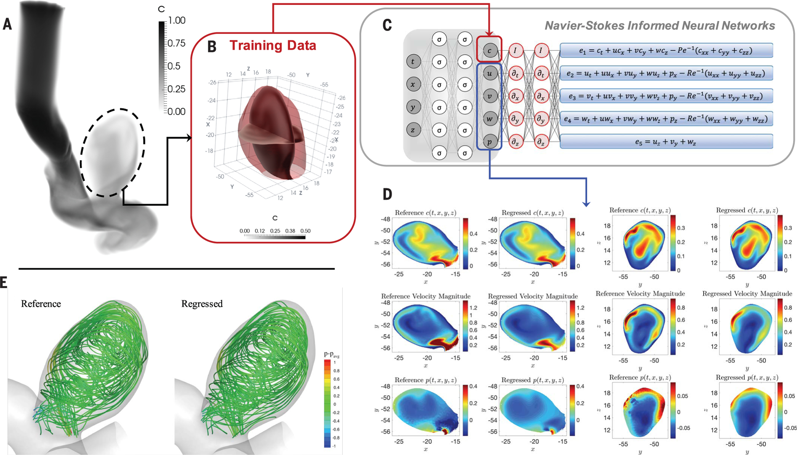

Neural networks are well-known for their ability to learn patterns from data, helping us make predictions and decisions in a variety of fields. But what if we could make these networks even smarter by teaching them to follow the rules that govern the world around us? That’s exactly what Physics-Informed Neural Networks (PINNs) do.

Normally, when you train a neural network, it learns from a set of data points to understand patterns and make predictions. However, this approach has a limitation, it’s too focused on the data itself and miss out on the bigger picture: **the fundamental laws of nature that govern the system being studied**. It doesn’t necessarily "know" the laws or principles that generated the data. For example, Imagine you're trying to predict the flow of ocean currents using a neural network. You feed it tons of data on ocean temperatures, salinity, and wind speeds. The network learns to fit the data and make predictions. However, it doesn't inherently understand the physics of fluid dynamics, the equations that govern how ocean currents actually behave. This lack of understanding can lead to inaccurate predictions, especially in scenarios where data are sparse or noisy.

PINNs address this limitation by **incorporating physical laws directly into the learning process,** To be more accurate PINNs are not exactly informed by physics, but rather by differential equations. This means that the network is not only trying to fit the data but also trying to satisfy the equations that describe the system. For the ocean current example, this could involve incorporating the Navier-Stokes equations, which are fundamental to fluid dynamics, into the network's learning process.

# How do we actually “inform” a neural network?

This "physics-informed" training is accomplished by embedding the differential equations that describes the system or the physical phenomenon directly into the neural network's loss function.
$$
L = L_{data}+L_{DE}
$$

A traditional neural network's loss function typically measures the difference between the network's predictions and the actual data points.

$$
L_{data} = \left(\hat u(x_i;\theta)-u(x_i)\right)^2
$$

However, a PINN's loss function has an additional component that reflects how well the network's predictions satisfy the governing equations.

For example, consider a PINN being trained to model the motion of a pendulum. The governing equation would be a second-order differential equation describing the pendulum's motion described by the following differential equation:

$$
m \frac{d^2u}{dx^2} + \mu \frac{du}{dx} + ku = 0
$$

Where $m$ is the mass of the oscillator, $\mu$ is the coefficient of friction and $k$ is the spring constant.

then loss for single prediction regarding the governing equation is described by:

$$
L_{DE} = \left(\left[ m \frac{d^2}{dx^2} + \mu \frac{d}{dx} + k \right] \hat u \right)^2
$$

This means the PINN is trained to achieve two goals simultaneously: fitting the data and adhering to the physics. The loss function becomes a balanced combination of these two objectives. By minimizing this combined loss function, the PINN learns to make predictions that are both data-driven and physically consistent

# Benefits of PINNs

Real-world data is rarely perfect. Whether due to measurement errors or limitations in our ability to collect information, data can often be noisy or sparse. Traditional machine learning models may struggle to make accurate predictions in these cases, especially when they lack the guiding hand of physical laws. PINNs, on the other hand, excel in this situation. By embedding known physics directly into the learning process, PINNs ensure that the solutions they find are physically plausible, even if the data is messy.

Another benefit of the PINN is its robustness and generalization ability. By constraining the predictions with physics, the model is less likely to overfit the training data and is more likely to make accurate predictions for unseen data points.

# Why Do We Need PINNs if We Already Have The Mathematical Model?

A question that immediately came to mind when I first learned about PINNs was: if we already have a mathematical model that describes a physical system, why not just use that? What is the benefit of incorporating that model into a neural network? The answer lies in the limitations of purely mathematical approaches and the unique advantages that PINNs offer in solving real-world problems. Let me elaborate:

In many cases, the mathematical models we use are only approximations. While they provide valuable insight, they often make simplifying assumptions that don’t fully capture the complexity of the system. Take fluid dynamics as an example: the Navier-Stokes equations describe the flow of fluids, but solving them for turbulent flow or in complex environments can be extraordinarily difficult. 
Here’s where PINNs come in. PINNs allow us to combine the power of physics with the flexibility of machine learning. Even when we have an incomplete or simplified model, PINNs can bridge the gap by incorporating experimental data, leading to solutions that are both accurate and computationally feasible.

Even if we have a complete and accurate model, solving it can be extremely time-consuming. Many mathematical models, especially those involving partial differential equations (PDEs), require complex numerical methods like finite element or finite difference methods. These methods can be slow and resource-intensive, particularly for high-dimensional systems or those with complicated boundary conditions.
PINNs offer a more efficient alternative. Instead of relying on traditional solvers, PINNs use neural networks to approximate the solution. This approach often leads to faster computations, allowing us to solve large-scale or high-dimensional problems that would otherwise take too long using standard methods.

In theory, if we had perfect mathematical models that were easy to solve, we wouldn’t need PINNs. But the reality is far more complex. Whether we’re dealing with incomplete models, slow numerical solvers, or noisy data, PINNs offer a powerful tool for solving real-world problems by combining the best of physics and machine learning. They allow us to not just use the models we have, but to push beyond their limitations and tackle challenges that were previously out of reach.

# The Power of PINNs

A very interesting paper that demonstrated the great ability of PINNs at inferring unmeasured variables is “Raissi M, Yazdani A, Karniadakis GE. Hidden fluid mechanics: Learning velocity and pressure fields from flow visualizations.”.

Flow visualization has been the art of making fluid motion visible in physical and biological systems Although such flow patterns can be, in principle, described by the Navier-Stokes equations, extracting the velocity and pressure fields directly from the images is challenging. The paper shows how you can infer detailed fluid flow properties, like velocity and pressure fields, using relatively limited data, which aren’t necessarily the data you are interested in like velocity and pressure using PINNs.

One notable example in the paper is Inferring quantitative hemodynamics in a 3D intracranial aneurysm. Normally, getting detailed data in such a scenario requires invasive techniques or advanced imaging tools. With PINNs, the researchers were able to reconstruct the velocity and pressure fields of blood flow from just a few observations (See section E in the above figure).