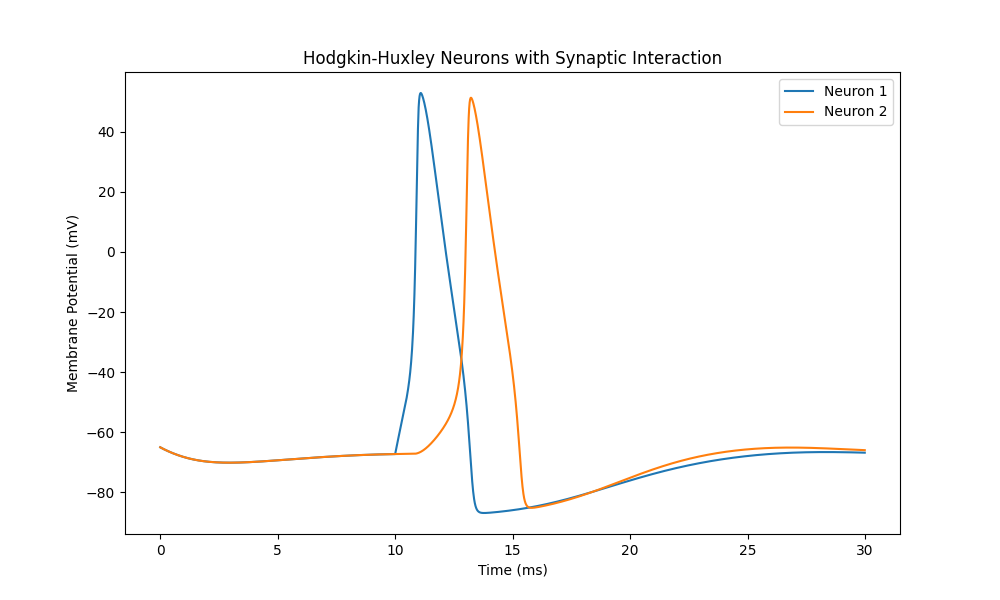

Simulating a single neuron is an easy task, thanks to the Hodgkin Huxley model, but simulating a network of neurons is less trivial and less documented over the internet.

In this blog, We’re going to simulate a simple network of neurons. We’re going to create a model and a simulation of two neurons that interact at a synapse.

# The Hodgkin-Huxley Model

The Hodgkin-Huxley model is a mathematical framework that describes how neurons generate and propagate electrical signals. Proposed in 1952 by Alan Hodgkin and Andrew Huxley, this model laid the foundation for modern neuroscience by detailing the ionic mechanisms underlying the action potential.

This section explores the model's biophysical basis, mathematical formulation, and the interplay between its variables.

## **The Biophysical Basis of the Model**

Neurons communicate using electrical signals, which are driven by differences in ion concentrations across their membranes. The key players are sodium $(\text{Na}^+)$ and potassium $(\text{K}^+)$ ions, along with leak channels that allow other ions to pass through. These ions move via specialized protein channels embedded in the neuronal membrane, driven by:

- **Concentration gradients:** Ions move from areas of high to low concentration.
- **Electrical gradients:** Opposite charges attract, while like charges repel.

The Hodgkin-Huxley model focuses on the squid giant axon and describes how the membrane potential evolves over time in response to ion movement.

## **The Membrane as an Electrical Circuit**

Hodgkin and Huxley modeled the neuron as the following electrical circuit.

. Bionics Chemical Synapse. [10.13140/RG.2.1.2295.1288](https://www.researchgate.net/publication/303389501_Bionics_Chemical_Synapse).")

By analyzing the circuit we get:

$$
I_\text{total} = C_m \frac{dV_m}{dt} + I_\text{Na} + I_\text{K} + I_\text{leak}
$$

where, $I_\text{total}$ is the total membrane current per unite area, $C_m$ is the membrane capacitance per unit area, and $V_m$ is the membrane potential. $I_\text{Na}$, $I_\text{K}$, and $I_\text{leak}$ are the sodium, potassium, and leak currents, respectively. These are referred to as ionic currents because they result from the movement of ions.

## **Ionic Currents and Conductance**

Each ionic current $(I_\text{ion})$ is determined by Ohm’s Law

$$
I_\text{ion} = g_{ion}(V_m-E_\text{ion})
$$

where $g_\text{ion}$ is the conductance of the ion channel, $V_m-E_\text{ion}$ is the driving force, with $E_\text{ion}$ as the ion’s reversal potential.

Hodgkin and Huxley introduced voltage and time-dependent variables to model $g_\text{ion}$ for sodium and potassium. Sodium conductance $(g_\text{Na})$ depends on activation $(m)$ and inactivation $(h)$ gating variables.

$$
g_\text{Na} = \bar{g}_\text{Na}m^3h
$$

where $\bar{g}_\text{Na}$ is the maximum sodium conductance.

Potassium conductance $(g_\text{K})$ depends on activation gating variable $n$

$$
g_\text{K} = \bar{g}_\text{K} n^4
$$

where $\bar{g}_\text{K}$ is the maximum potassium conductance.

Leak channels account for the natural permeability of the membrane to ions, where the conductance of those ion channels $(g_\text{leak})$ is a constant. Thus, the leak current due to passive leak ion channels in the Hodgkin-Huxley formalism is $I_\text{leak}=g_\text{leak}(V_m-E_\text{leak})$. 

## Gating Variables and Their Dynamics

The gating variables $(m,h,n)$ represent the probabilities of ion channels being open or closed. Their dynamics are governed by first-order differential equations:

$$
\frac{dx}{dt} = \alpha_x (1-x) - \beta_x x, \quad x \in \{m,h,n\}
$$

where $\alpha_x$ and $\beta_x$ are rate constants that depend on the membrane potential $V_m$.

For instance, the equations for sodium activation $(m)$ and inactivation $(h)$ rates are:

$$
\begin{align*}
&\alpha_m= \frac{0.1(V_m + 40)}{1-e^{-(V_m+40)/10}}, \quad \beta_m = 4e^{-0.0556(V_m+65)}, \\ &\alpha_h = 0.07e^{−0.05(V_m+65)}, \quad \beta_h=\frac{1}{1+e^{−(V_m+35)/10}} \; .
\end{align*}
$$

These equations are fitted to experimental data, capturing the voltage-sensitive gating of ion channels.

## Putting it all together

Combining the equations for ionic currents and gating variables, Hodgkin and Huxley derived the full equation for membrane potential dynamics:

$$
I_\text{total} = C_m \frac{dV_m}{dt} + \bar{g}_\text{Na}m^3h(V_m-E_\text{Na})+\bar{g}_\text{K}n^4(V_m-E_\text{K})+ g_\text{leak} (V_m-E_\text{leak})
$$

In many cases $I_\text{total}$ is the external stimulus current applied to the neuron, thus the equation can be rewritten as:

$$
I_\text{ext} = C_m \frac{dV_m}{dt} + \bar{g}_\text{Na}m^3h(V_m-E_\text{Na}) + \bar{g}_\text{K}n^4(V_m-E_\text{K}) + g_\text{leak}(V_m-E_\text{leak})
$$

Using this model, Hodgkin and Huxley successfully simulated action potentials, showing how a small depolarizing stimulus triggers a rapid rise and fall in $V_m$. The interplay between $g_\text{Na}$ and $g_\text{K}$ explains the characteristic shape of action potentials, with sodium driving the upstroke and potassium restoring the resting state.

# The Synapse

Hodgkin and Huxley provided us with a great model to simulate a **single** neuron, but modeling a network of neurons requires the modeling of the connection points between the neurons, and those are the synapses.

A synapse is the junction between two neurons that allows a signal to pass from one neuron to another. Synapses can be classified as either chemical or electrical, depending on the mechanism of signal transmission between neurons. In this article we will focus on chemical synapses.

As a structure, the synapse is a small gap between the two neurons. The presynaptic neuron is the neuron that sends the signal, and the postsynaptic neuron is the neuron that receives the signal.

At the arrival of the action potential (signal) to the axon terminal of the presynaptic neuron voltage-gated calcium channels open, allowing calcium ions (Ca²⁺) to enter the presynaptic neuron. This triggers synaptic vesicles to release neurotransmitters into the synaptic cleft via exocytosis.

The neurotransmitters bind to receptors on the postsynaptic membrane, leading to the flow of ions through receptor-associated channels. This ion flow generates the **synaptic current**. The synaptic current can be excitatory or inhibitory. **Excitatory synaptic currents**, typically caused by the influx of positive ions like $\text{Na}^+$, depolarize the postsynaptic membrane, increasing the likelihood of firing an action potential. **Inhibitory synaptic currents**, often due to the influx of $\text{Cl}^-$ or efflux of $\text{K}^+$, hyperpolarize the membrane, reducing this likelihood.

The magnitude and duration of the synaptic current depend on neurotransmitter release, receptor dynamics, and ion channel properties, shaping the postsynaptic neuron's response to the signal.

.")

# Modeling The Synapse

Modeling synapses, particularly chemical synapses, requires a detailed understanding of the dynamics of neurotransmitter release, receptor activation, and subsequent ion flow in the postsynaptic neuron. What is usually meant by modeling the synapse is modeling the **synaptic current** flowing into the postsynaptic cell and its effect.

## **The Synaptic Current**

The synaptic current $I_{syn}$ is generated when neurotransmitters bind to receptors on the postsynaptic neuron, triggering ion channels to open. The synaptic current is mathematically expressed as:

$$
I_{syn} = g_{syn}(V_m - E_{syn})
$$

where:

- $g_{syn}$ is the synaptic conductance, representing the strength and dynamics of the synapse.
- $V_m$ is the membrane potential of the postsynaptic neuron.
- $E_{syn}$ is the synaptic reversal potential, determined by the type of neurotransmitter and ion channels involved.  For inhibitory synapses $E_{syn}$ is usually set to −75 mV, whereas for excitatory synapses  $E_{syn} \approx 0$.

## **Synaptic Conductance Dynamics**

The synaptic conductance $g_{syn}$ evolves over time based on neurotransmitter release and receptor kinetics. It is often modeled as:

$$
g_{syn}(t) = g_{max} \cdot s(t)
$$

where $g_{max}$ is the maximum synaptic conductance and $s(t)$ is the synaptic gating variable, describing the fraction of open synaptic channels. Channels open when neurotransmitter $N$ bind to the synapse.

The gating variable $s(t)$ is governed by the following first-order differential equation:

$$
\frac{ds}{dt} = \alpha_{syn} N (1-s) - \beta_{syn} s
$$

where $\alpha_{syn}$ is the binding constant, $\beta_{syn}$ the unbinding constant and $(1−s)$ the fraction of closed channels where binding of neurotransmitter can occur.

## **Excitatory and Inhibitory Synapses**

Synapses can be classified based on their effect on the postsynaptic neuron as excitatory or inhibitory. Excitatory Synapses are typically associated with neurotransmitters like glutamate, induce depolarization of the postsynaptic membrane by allowing the influx of cations such as $\text{Na}^+$. This increases the likelihood of the postsynaptic neuron reaching the threshold to fire an action potential. The reversal potential $E_{\text{syn}}$ for excitatory synapses is usually positive relative to the resting membrane potential, approximately equals Zero mV.

Inhibitory Synapses are often linked with neurotransmitters like GABA, these synapses facilitate hyperpolarization by allowing the influx of $\text{Cl}^-$ ions or efflux of $\text{K}^+$. This decreases the likelihood of action potential generation. The reversal potential $E_{\text{syn}}$ for inhibitory synapses is typically negative relative to the resting membrane potential, approximately equals -75 mV.

# **Integrating Synapses with the Hodgkin-Huxley model of the neuron**

To simulate a network of neurons effectively, we need to incorporate synaptic currents into the Hodgkin-Huxley framework. This integration involves modifying the original Hodgkin-Huxley equations to account for the additional current generated by synaptic activity. The resulting model captures both the intrinsic dynamics of individual neurons and their interactions via synaptic connections.

The Hodgkin-Huxley equation describes the membrane potential dynamics of a neuron as:

$$
I_\text{ext} = C_m \frac{dV_m}{dt}+\bar{g}_\text{Na}m^3h(V_m-E_\text{Na})+\bar{g}_\text{K}n^4(V_m-E_\text{K})+ g_\text{leak}(V_m-E_\text{leak})
$$

To account for synaptic input, we include the synaptic current $I_\text{syn}$:

$$
I_\text{ext} = C_m \frac{dV_m}{dt} + \bar{g}_\text{Na}m^3h(V_m-E_\text{Na}) + \bar{g}_\text{K}n^4(V_m-E_\text{K}) + g_\text{leak}(V_m-E_\text{leak}) + I_\text{syn}
$$

The synaptic current is given by, as defined earlier:

$$
I_\text{syn} = g_\text{syn}(V_m - E_\text{syn})
$$

To simulate a network, we model the synaptic inputs from presynaptic neurons as events that modulate $N$. For instance, when a presynaptic neuron fires an action potential, it releases neurotransmitters into the synaptic cleft, temporarily increasing $N$. This causes $s(t)$ to rise, increasing $g_\text{syn}$ and inducing a synaptic current in the postsynaptic neuron.

In a network, neurons may receive inputs from multiple synapses—both excitatory and inhibitory. The total synaptic current becomes:

$$
I_\text{syn} = \sum_{i \in \text{exc}} g_{\text{syn},i}(V_m - E_{\text{syn},i}) + \sum_{j \in \text{inh}} g_{\text{syn},j}(V_m - E_{\text{syn},j})
$$

Here, the first term represents excitatory inputs, and the second term represents inhibitory inputs. The balance of these inputs determines whether the neuron reaches the threshold to fire an action potential.

By integrating synaptic currents into the Hodgkin-Huxley model, we can simulate complex neural networks where individual neurons interact via excitatory and inhibitory synapses.

# Implementing the Computational Model in Python

Let’s implement a network that consists of just two neurons

```python
import numpy as np
from scipy.integrate import odeint
import matplotlib.pyplot as plt

# Hodgkin-Huxley Parameters
Cm = 1  # in microF/cm
g_Na, g_K, g_L = 120, 36, 0.3
E_Na, E_K, E_L = 60, -88, -54.387

# Synaptic parameters
g_syn_ex = 0.5  # excitatory synaptic conductance
g_syn_in = 1.0  # inhibitory synaptic conductance
E_syn_ex = 0  # excitatory reversal potential
E_syn_in = -80  # inhibitory reversal potential
alpha_s = 0.5  # Rate constant for channel opening
beta_s = 0.1  # Rate constant for channel closing
threshold = -20  # Presynaptic spike threshold

# Gate dynamics
def alpha_n(V):
    return 0.01 * (V + 55) / (1 - np.exp(-(V + 55) / 10))

def beta_n(V):
    return 0.125 * np.exp(-(V + 65) / 80)

def alpha_m(V):
    return 0.1 * (V + 40) / (1 - np.exp(-(V + 40) / 10))

def beta_m(V):
    return 4 * np.exp(-(V + 65) / 18)

def alpha_h(V):
    return 0.07 * np.exp(-(V + 65) / 20)

def beta_h(V):
    return 1 / (1 + np.exp(-(V + 35) / 10))

# Ionic currents
def I_Na(V, m, h):
    return g_Na * m**3 * h * (V - E_Na)

def I_K(V, n):
    return g_K * n**4 * (V - E_K)

def I_L(V):
    return g_L * (V - E_L)

def N(V_pre):
    return 1 if V_pre > threshold else 0

def synaptic_current(V_pre, V_post, g_syn, E_syn, r):
    return g_syn * r * (E_syn - V_post)

def ds_dt(s, V_pre):
    return alpha_s * N(V_pre) * (1 - s) - beta_s * s

# Stimulus function
def I_stim(t, stimulus_initial_time, stimulus_duration):
    return (
        40
        if stimulus_initial_time <= t < (stimulus_initial_time + stimulus_duration)
        else 0
    )

def dSystem_dt(X, t, stimulus_initial_time, stimulus_duration, synapse_type):
    V_1, m_1, h_1, n_1 = X[0:4]
    V_2, m_2, h_2, n_2 = X[4:8]
    s = X[8]

    g_syn = g_syn_in if (synapse_type == "in") else g_syn_ex
    E_syn = E_syn_in if (synapse_type == "in") else E_syn_ex

    # Synaptic currents
    I_syn = synaptic_current(V_1, V_2, g_syn, E_syn, s)

    # Dynamics of gating variables
    ds = ds_dt(s, V_1)

    # Sensory neuron dynamics
    dV_1 = (
        I_stim(t, stimulus_initial_time, stimulus_duration)
        - I_Na(V_1, m_1, h_1)
        - I_K(V_1, n_1)
        - I_L(V_1)
    ) / (Cm)
    dm_1 = alpha_m(V_1) * (1 - m_1) - beta_m(V_1) * m_1
    dh_1 = alpha_h(V_1) * (1 - h_1) - beta_h(V_1) * h_1
    dn_1 = alpha_n(V_1) * (1 - n_1) - beta_n(V_1) * n_1

    # Extensor motor neuron dynamics
    dV_2 = (
        + I_syn
        - I_Na(V_2, m_2, h_2)
        - I_K(V_2, n_2)
        - I_L(V_2)
    ) / (Cm)
    dm_2 = alpha_m(V_2) * (1 - m_2) - beta_m(V_2) * m_2
    dh_2 = alpha_h(V_2) * (1 - h_2) - beta_h(V_2) * h_2
    dn_2 = alpha_n(V_2) * (1 - n_2) - beta_n(V_2) * n_2

    return [
        dV_1,
        dm_1,
        dh_1,
        dn_1,
        dV_2,
        dm_2,
        dh_2,
        dn_2,
        ds,
    ]

dt = 0.01
simulation_duration = 30 # in ms
# Time vector
t = np.arange(0, simulation_duration, dt)

# Initial conditions for all neurons (resting state)
X0 = np.array([-65, 0.05, 0.6, 0.32] * 2 + [0.0])

# Solve the system
stimulus_initial_time = 10 # in ms
stimulus_duration = 1 # in ms
synapse_type = "in"

X = odeint(dSystem_dt, X0, t, args=(stimulus_initial_time, stimulus_duration, synapse_type))
neuron_1_potential = X[:,0]
neuron_2_potential = X[:,4]

# Plotting
plt.figure(figsize=(10, 6))
plt.plot(t, neuron_1_potential, label="Neuron 1")
plt.plot(t, neuron_2_potential, label="Neuron 2")
plt.xlabel("Time (ms)")
plt.ylabel("Membrane Potential (mV)")
plt.title("Hodgkin-Huxley Neurons with Synaptic Interaction")
plt.legend()
plt.show()

```

## Results

