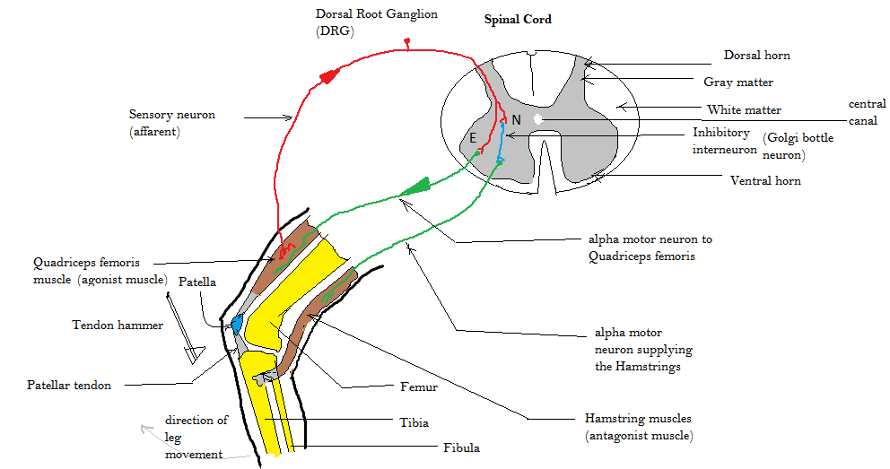
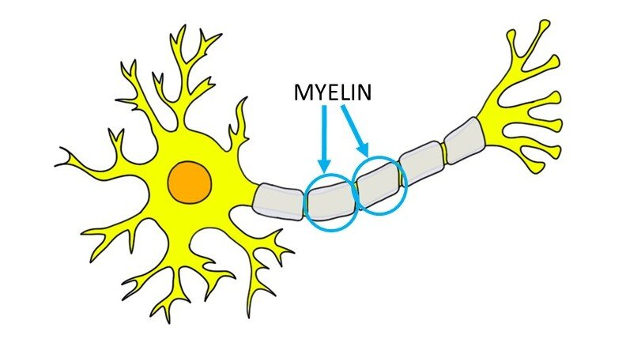

You can download the simulator from Github releases and you can check the full Github repo of the project.

 Github " cta_link="https://github.com/Gad-MA/A-3D-Simulator-of-the-Patellar-Reflex-and-Demyelination-Effects" cta_new_tab="true" >}}

# Table of Contents
- [Table of Contents](#table-of-contents)
- [Introduction](#introduction)
  - [Patellar Reflex Circuit](#patellar-reflex-circuit)
  - [Demyelination of Neurons](#demyelination-of-neurons)
- [Implementing The Model in Python](#implementing-the-model-in-python)
- [Creating the 3D Visualization using Unity](#creating-the-3d-visualization-using-unity)
- [Result](#result)
<!-- - [Challenges and Lessons Learned] -->

This project has multiple aspects: biological/anatomical analysis, computational modeling in Python, and a 3D simulation using Unity. You can use the table of contents to navigate to the aspect that interests you most.

# Introduction

This project is about building a mathematical model of the neuron and the impact of demyelination on the neuronal characteristics, more on the significance of understanding the impact of demyelination of neurons in the [Demyelination of Neurons](#demyelination-of-neurons) section.

To put our model in a meaningful context, we will use it to simulate the neuronal circuit of the patellar reflex. We chose the patellar reflex circuit because it's relatively simple and doesn't require brain processing. It can be represented by just four neurons: two motor neurons, a sensory neuron, and an inhibitory interneuron.

But who enjoys staring at simulation plots or a bunch of numbers? That's why we decided to take it a step further by developing a 3D simulator, allowing the user to visualize the simulations in action on a 3D model of the leg and the neurons of the patellar reflex circuit.

Let's start by covering the essential background you need in this introduction section.

## Patellar Reflex Circuit

The above figure illustrates circuit diagram for the patellar reflex or knee jerk reflex which is a test used to examine the integrity of the sensory and motor pathways of a portion of the lumbar spinal cord. The tap of hammer stretches the leg muscle and leads to the initiation of action potentials in sensory neurons within the muscle that are sensitive to stretch. The action potentials propagate into the spinal cord where the axon splits into two branches. At the extensor motor neuron terminal (terminal E), the action potential propagates directly into an extensor motor neuron. This is a basic example of feedforward excitation pathway. At the interneuron terminal (terminal N), the action potential expands to an inhibitory interneuron which is interposed before the flexor motor neuron. This leads to an inhibitory postsynaptic potential which makes the action potential less likely to propagate down the flexor motor neuron so it will decrease the probability of undesired flexion in the leg muscle. This is why when a doctor taps your leg, it will extend instead of flex. This is an example of feedforward inhibition. We will be studying the effects of demyelination of these four neurons in this circuit.

The neuronal relationship of the Patellar Reflex Circuit is represented in the block diagram shown in the figure below.
.")

## Demyelination of Neurons

The proper functioning of the patellar reflex cricuit—and indeed, the entire nervous system—relies heavily on the integrity of myelin, a fatty substance that insulates neuronal axons. Demyelination refers to the damage or loss of this myelin sheath, which can severely disrupt the transmission of electrical signals along neurons.

Myelin acts as an insulating layer, much like the plastic coating around an electrical wire. It allows action potentials to propagate rapidly and efficiently along the axon through a process called saltatory conduction. When myelin is damaged, this conduction slows down or fails entirely, leading to delayed or blocked signal transmission. In the context of the patellar reflex, demyelination of the sensory or motor neurons could impair the reflex response, causing either a delayed extension or a complete lack of movement in the leg.

Demyelination increases a neuron's membrane conductance by stripping away the protective myelin sheath. This exposure raises the effective capacitance of the axon, causing slower action potential propagation and allowing more ions to leak out. As a result, the efficiency of electrical signal transmission is compromised, leading to significant functional deficits in the affected neurons.

Demyelination is a serious issue because it underlies several debilitating neurological disorders, such as multiple sclerosis (MS), Guillain-Barré syndrome, and Charcot-Marie-Tooth disease. In MS, for example, the immune system mistakenly attacks the myelin sheath in the central nervous system, leading to symptoms like muscle weakness, coordination problems, and fatigue. Over time, repeated demyelination can result in permanent damage to the axons themselves, causing irreversible neurological deficits.

The consequences of demyelination extend beyond physical symptoms. Slowed or disrupted signal transmission can affect cognitive functions, sensory processing, and even autonomic functions like heart rate and digestion. This makes demyelination not just a localized issue but a systemic one, impacting the overall functionality of the nervous system.

In this project, we explore how demyelination affects the patellar reflex circuitry by simulating the degradation of myelin in the sensory, extensor motor, interneuron, and flexor motor neurons. By understanding these effects, we can gain deeper insights into the broader implications of demyelination and its impact on neural communication.

# Implementing The Model in Python

I've dedicated a whole blog post on modeling neurons and synaptic connections (see [this post](/post/synaptic-dynamics-with-hodgkin-huxley/)), where I included a simulation of a simple circuit of two neurons. I recommend checking it out, as I'll be extending on the concepts and implementation discussed there.

As discussed in the [Demyelination of Neurons](#demyelination-of-neurons) section, demyelination increases a neuron's membrane conductance. In our very specific case, through experimentation on the impact of capacitance on signal latency from one neuron to another, the demyelinated neuron's membrane capacitance will increase to 7 $\mu \text{F/cm}$. This will be reflected in the value of the capacitance paramater of the neuron's model (The Hodgkin-Huxley Model).

Building on the implementation outlined in the earlier blog post, we can extend the simulation to model the four neurons involved in the patellar reflex circuit and incorporate the effects of demyelination. Check the simulation code of patellar reflex [here](https://github.com/Gad-MA/A-3D-Simulator-of-the-Patellar-Reflex-and-Demyelination-Effects/blob/fe5d45086811f061ec03addbe905cfc969bc988f/ExternalData/HH_Computational_Model.py) on Github.

# Creating the 3D Visualization using Unity

Coming Soon...

# Result

<video src="./images/orientation_github.mp4" controls></video>